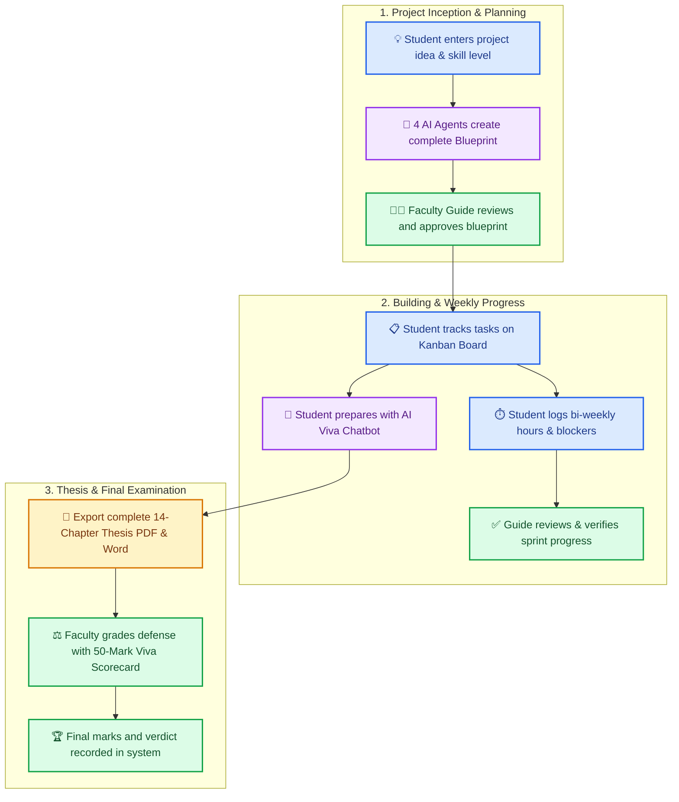
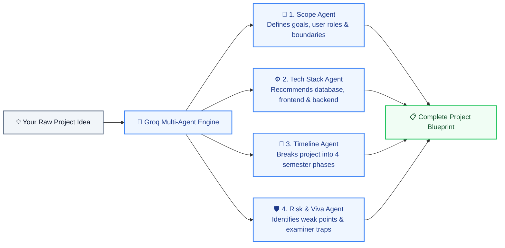

# 🎓 AI Project Mentor

### 🚀 From Project Idea to Final Viva Defense

<div align="center">

[](https://react.dev)
[](https://vitejs.dev)
[](https://tailwindcss.com)
[](https://fastapi.tiangolo.com)
[](https://www.python.org)
[](https://www.mongodb.com/atlas)
[](https://groq.com)
[](LICENSE)

<p align="center">
  <b>A smart, all-in-one mentor for ANYONE who wants to build a project but doesn't know where to start.</b><br/>
  From first-time beginner ideas and semester mini-projects to hackathon MVPs and university final viva defenses — AI Project Mentor turns your raw thoughts into a structured architecture, tracks your progress, and guides you all the way to completion.
</p>

[🎯 Who Is This For?](#-who-is-this-for) •
[💡 Why This Platform?](#-why-ai-project-mentor) •
[🔄 How It Works](#-how-it-works-step-by-step) •
[🤖 The 4 AI Agents](#-the-4-ai-planning-agents) •
[✨ Student Features](#-student-platform-features) •
[👩‍🏫 Faculty Features](#-faculty-portal-features) •
[⚖️ Viva Rubric](#-standardized-50-mark-viva-defense-rubric) •
[🚀 Quick Start Guide](#-quick-start-guide)

</div>

---

## 🎯 Who Is This For?

**AI Project Mentor is NOT just for final-year college capstones.** It is built for **anyone with a project idea who needs guidance on where to start and how to finish**:

* 🐣 **Complete Beginners & Self-Learners**: Have a cool idea, but don't know whether to use Python, React, Node.js, or SQL? Type your idea in plain English, and the AI will recommend the easiest tech stack and a step-by-step roadmap to build it.
* ⚡ **Hackathon Teams & Rapid Prototypers**: Need to design a solid MVP architecture under time pressure? Generate user personas, boundaries, and sprint milestones in seconds.
* 📚 **1st, 2nd & 3rd Year Mini-Projects**: Perfect for semester assignments and college lab projects that need organized tasks, Kanban tracking, and clean technical documentation.
* 🎓 **Final-Year Engineering Students**: Everything you need to ace your capstone — bi-weekly sprint logging, an automated 14-chapter thesis generator ready for black-book binding, and an AI mock viva examiner.
* 👩‍🏫 **Professors, Guides & Mentors**: A unified dashboard to track multiple teams, review sprint hours, clear blockers, and grade final defenses fairly using a digital 50-mark rubric.

---

## 💡 Why AI Project Mentor?

Starting a new project is exciting, but most people get stuck before they even write their first line of code:

| ❌ Common Roadblocks (Where People Get Stuck) | ✅ With AI Project Mentor (How It Helps You) |
|---|---|
| **Don't Know Where to Start**: You have a vision, but no clue which tools, databases, or frameworks to pick. | 🤖 **AI Architecture Wizard**: Turns your raw idea into realistic goals, recommended tech stacks, and step-by-step phases. |
| **Losing Motivation & Getting Lost**: Big projects feel overwhelming without clear daily or weekly steps. | 📋 **Interactive Kanban Board**: Breaks the whole project into bite-sized milestones (*To Do*, *In Progress*, *Done*). |
| **No Progress Accountability**: Without regular check-ins, projects get delayed until the very last minute. | ⏱️ **Bi-Weekly Progress Logs**: Log hours worked, track milestones, report blockers, and receive guide sign-offs. |
| **Fear of Viva & Technical Questions**: You built something, but don't know how to defend your choices to evaluators. | 💬 **AI Viva Preparation Chat**: A 24/7 mock examiner trained on your exact project stack to quiz you and build your confidence. |
| **Thesis & Report Formatting Pain**: Writing a 14-chapter report and fixing margins in Word takes days of frustrating work. | 📄 **1-Click 14-Chapter Thesis**: Generates complete academic reports ready for printing in PDF and Word (`.docx`). |
| **Inconsistent or Subjective Grading**: College evaluations often lack clear, standardized digital rubrics. | ⚖️ **Standard 50-Mark Rubric**: Clear digital scorecard covering Architecture, Code Demo, Documentation, and Viva Defense. |

---

## 🔄 How It Works (Step-by-Step)



---

## 🤖 The 4 AI Planning Agents

When a student submits an idea, our system does not just call a generic chatbot. It runs a team of **4 specialized AI agents** powered by ultra-fast Groq LLMs (`llama-3.3-70b-versatile`):



1. **🎯 Scope & Problem Agent**: Clearly explains the problem, who will use the app, and what features are included or excluded (prevents taking on too much work).
2. **⚙️ Tech Stack Architect**: Recommends the best frontend, backend, database, and libraries based on student skill level, explaining why each tool is chosen.
3. **📅 Timeline & Milestone Agent**: Creates a realistic 4-phase semester roadmap with weekly goals.
4. **🛡️ Viva Defense & Risk Auditor**: Predicts the hardest questions external examiners will ask and warns about common architectural mistakes before coding starts.

---

## ✨ Student Platform Features

Everything a student needs to take a project from concept to final submission:

* 🤖 **AI Architecture Wizard**: Fill in your title, domain, and a short idea. Get back a full architecture blueprint in seconds.
* 📋 **Interactive Kanban Board**: Move milestone cards between **To Do**, **In Progress**, and **Done** to keep your team organized.
* 💬 **AI Viva Preparation Chat**: A 24/7 AI mock examiner that knows your project's code and tech stack. Ask it to quiz you or explain tricky concepts.
* 📈 **Live Progress Slider**: Update your completion percentage anytime to let your guide know where you stand.
* ⏱️ **Bi-Weekly Hours & Blocker Log**: Log hours worked each fortnight, list tasks finished, and report any technical blockers to get help from your mentor.
* 📄 **14-Chapter Thesis Generator**: Automatically turns your project architecture and progress into a formal university manuscript. Download it with one click as **PDF** or **Word (`.docx`)** ready for black-book binding!

---

## 👩‍🏫 Faculty Portal Features

A complete control center for project guides, department heads, and external examiners:

* 🏛️ **Project Approval Hub**: Read submitted blueprints, check student tech stacks, and grant formal verdicts (**Approved**, **Needs Revision**, or **Rejected**).
* 👥 **My Mentees Dashboard**: View all students assigned to you, check how many hours they spent, and verify their bi-weekly sprint submissions.
* 🏢 **Department Roster**: A master list of all college final-year projects, showing team members, assigned guides, and current review status.
* 📢 **Department Noticeboard**: Post announcements about submission deadlines, format guidelines, or viva schedules that appear instantly on student dashboards.
* ⚖️ **Standard 50-Mark Viva Scorecard**: Grade students during their live presentation using an easy point-and-click digital rubric.

---

## ⚖️ Standardized 50-Mark Viva Defense Rubric

The platform replaces subjective paper notes with an official, standardized 50-mark digital scorecard:

| Category | Max Marks | What the Examiners Check |
|---|:---:|---|
| **1. System Architecture & Engineering** | **10** | Is the system modular? Is the database well designed? Are the APIs clean? |
| **2. Code Execution & Working Demo** | **20** | Does the live demo actually work? Is error handling clean? Is the code well written? |
| **3. Presentation & Thesis Quality** | **10** | Is the 14-chapter report complete? Are diagrams neat? Are references properly cited? |
| **4. Viva Defense & Q&A Mastery** | **10** | Can the student defend their design choices? Do they understand edge cases? |
| **Total Marks** | **50** | **Final Verdict**: *Distinction (40-50)* • *Satisfactory (25-39)* • *Re-exam (<25)* |

---

## 📑 14-Chapter University Thesis Structure

The built-in thesis export automatically formats all 14 standard university chapters:

```
├── CHAPTER 1: TITLE & EXECUTIVE ABSTRACT
├── CHAPTER 2: INTRODUCTION & PROBLEM BACKGROUND
├── CHAPTER 3: PROBLEM FORMULATION & MOTIVATION
├── CHAPTER 4: LITERATURE SURVEY & STATE OF THE ART
├── CHAPTER 5: PROPOSED SYSTEM ARCHITECTURE & DIAGRAMS
├── CHAPTER 6: FUNCTIONAL & NON-FUNCTIONAL REQUIREMENTS
├── CHAPTER 7: TECHNOLOGY STACK SELECTION & TRADEOFFS
├── CHAPTER 8: DATABASE SCHEMA & DATA FLOW DESIGN
├── CHAPTER 9: SYSTEM IMPLEMENTATION & KEY MODULES
├── CHAPTER 10: TESTING METHODOLOGY & TEST CASES
├── CHAPTER 11: RESULTS & EXPERIMENTAL ANALYSIS
├── CHAPTER 12: SECURITY, PRIVACY & PRODUCTION READINESS
├── CHAPTER 13: LIMITATIONS & FUTURE SCOPE
└── CHAPTER 14: REFERENCES & IEEE CITATIONS
```

---

## 🛠️ Tech Stack & Tools Used

| Layer | Technology | Why We Use It |
|---|---|---|
| 💻 **Frontend** | **React 18 + Vite** | Blazing fast user interface with instant page loads. |
| 🎨 **Styling** | **Tailwind CSS** | Clean, modern university blue-and-white theme. |
| 🔣 **Icons** | **Lucide React** | Crisp, professional SVG icons across all dashboards. |
| ⚡ **Backend** | **FastAPI (Python 3.10+)** | High-speed asynchronous REST API with automatic documentation. |
| 🗄️ **Database** | **MongoDB Atlas** | Secure cloud database storing users, blueprints, logs, and marks. |
| 🧠 **AI Engine** | **Groq Cloud API** | Ultra-low latency inference using Llama 3.3 70B and Llama 3.1 8B. |
| 📑 **PDF Export** | **ReportLab** | Generates clean, bound academic PDF thesis documents. |
| 📝 **Word Export** | **python-docx** | Produces editable `.docx` manuscripts for final edits. |

---

## 📂 Project Structure

```plaintext
AI-Project-Mentor/
├── backend/
│   ├── main.py              # FastAPI endpoints, multi-agent logic & auth
│   ├── database.py          # MongoDB Atlas connection & database queries
│   ├── models.py            # Pydantic models & data validation
│   ├── agents/              # Council agent prompt templates
│   └── requirements.txt     # Python backend dependencies
│
├── frontend-react/
│   ├── src/
│   │   ├── components/
│   │   │   ├── Sidebar.jsx                   # University navigation & role menu
│   │   │   └── CustomSelect.jsx              # Clean styled dropdown selector
│   │   ├── pages/
│   │   │   ├── LandingPage.jsx               # Public university portal landing page
│   │   │   ├── AuthPage.jsx                  # Sign in & registration with role guard
│   │   │   ├── DashboardPage.jsx             # Student project hub & progress stats
│   │   │   ├── FacultyDashboardPage.jsx      # Mentees tracking & department roster
│   │   │   ├── WorkspacePage.jsx             # 4-Agent blueprint generation wizard
│   │   │   ├── BenchmarksPage.jsx            # Explore past projects & viva scores
│   │   │   ├── VivaGradingPage.jsx           # Committee 50-mark viva grading portal
│   │   │   ├── NoticeboardPage.jsx           # Institutional cohort announcements
│   │   │   ├── StudentProgressUpdatePage.jsx # Student progress & completion sliders
│   │   │   ├── BatchProgressTrackerPage.jsx  # Faculty batch progress matrix
│   │   │   ├── SettingsPage.jsx              # Institutional profile & password update
│   │   │   ├── ChatMentorPage.jsx            # AI mentor external examiner chat
│   │   │   ├── KanbanPage.jsx                # Sprint roadmap milestone board
│   │   │   └── ThesisDocPage.jsx             # 14-chapter thesis compiler & export
│   │   ├── App.jsx                           # Route controller & screen layout
│   │   ├── index.css                         # Custom styling tokens
│   │   └── main.jsx                          # React application entry point
│   ├── vite.config.js                       # Port 5174 development server config
│   └── package.json                         # Node.js dependencies
│
├── requirements.txt                         # Root Python backend dependencies
├── .env                                     # Environment variables (API keys)
├── LICENSE                                  # MIT Open-Source License
└── README.md                                # Project documentation
```

---

## 🔌 API Endpoints Reference

All backend routes are documented with interactive Swagger docs at `http://127.0.0.1:8000/docs`:

| Method | Route | Who Uses It | What It Does |
|:---:|---|:---:|---|
| `POST` | `/api/auth/register` | Anyone | Create a new student or faculty account. |
| `POST` | `/api/auth/login` | Anyone | Sign in and receive an active user session. |
| `POST` | `/api/generate-blueprint` | Student | Run the 4-agent AI council to create a project blueprint. |
| `GET` | `/api/user/history` | Student | Get all saved projects belonging to the logged-in student. |
| `GET` | `/api/faculty/blueprints` | Faculty | View all project submissions across the whole department. |
| `POST` | `/api/faculty/review` | Faculty | Submit supervisor review comments and approval verdicts. |
| `POST` | `/api/mentor/assign` | Faculty | Claim or assign a faculty guide to a student project. |
| `POST` | `/api/student/submit-log` | Student | Submit bi-weekly hours, accomplishments, and blockers. |
| `POST` | `/api/mentor/verify-log` | Faculty | Approve or ask for clarification on student sprint logs. |
| `POST` | `/api/faculty/viva-grading` | Faculty | Submit the official 50-mark viva score and verdict. |
| `GET` | `/api/faculty/viva-scores` | Faculty | View all recorded viva scores for archiving. |
| `POST` | `/api/projects/pitfalls` | Anyone | Generate common mistakes and examiner questions for any topic. |
| `POST` | `/api/faculty/announcements`| Faculty | Broadcast a notice with deadline dates to all students. |
| `GET` | `/api/announcements` | Both | Fetch active announcements to display on noticeboards. |
| `GET` | `/api/export/pdf` | Student | Download executive architecture summary as a clean PDF. |
| `GET` | `/api/export/docx` | Student | Download editable project blueprint in Microsoft Word format. |
| `GET` | `/api/export/thesis-pdf` | Student | Compile and download complete 14-chapter thesis in PDF. |

---

## 🚀 Quick Start Guide

Follow these steps to run the complete platform on your computer in under 5 minutes.

### 1. Prerequisites
Make sure you have installed:
* **Node.js** (version 18 or higher) - [Download](https://nodejs.org/)
* **Python** (version 3.10 or higher) - [Download](https://python.org/)
* **MongoDB** (Local instance or free [MongoDB Atlas](https://www.mongodb.com/atlas) cloud URI)
* **Groq API Key** (Free, takes 30 seconds at [console.groq.com](https://console.groq.com))

---

### 2. Backend Setup (FastAPI)

1. Open a terminal and enter the `backend/` directory:
   ```bash
   cd backend
   ```

2. Create and activate a Python virtual environment:
   ```bash
   # On Windows (PowerShell / CMD):
   python -m venv venv
   venv\Scripts\activate

   # On macOS or Linux:
   python3 -m venv venv
   source venv/bin/activate
   ```

3. Install the dependencies:
   ```bash
   pip install -r requirements.txt
   ```

4. Create a `.env` file in the project root or `backend/` folder:
   ```env
   GROQ_API_KEY=gsk_your_groq_api_key_here
   MONGO_URI=mongodb://localhost:27017
   DB_NAME=ai_project_mentor
   ```

5. Start the backend server:
   ```bash
   uvicorn main:app --reload --port 8000
   ```
   * Backend runs at: **http://127.0.0.1:8000**
   * Interactive API docs: **http://127.0.0.1:8000/docs**

---

### 3. Frontend Setup (React + Vite)

1. Open a **second terminal** and enter the `frontend-react/` directory:
   ```bash
   cd frontend-react
   ```

2. Install the frontend packages:
   ```bash
   npm install
   ```

3. Start the frontend development server:
   ```bash
   npm run dev
   ```
   * Open your browser at: **http://localhost:5174**

---

## 👥 User Roles & How to Use

### 👨‍🎓 For Students:
1. Open **http://localhost:5174** and choose **"Student Sign In"** (or click Register to create your account).
2. Go to **Workspace** and type in your project idea. Click **Generate Blueprint** to let the 4 AI agents plan your architecture.
3. Open the **Kanban Board** to organize your tasks into *To Do*, *In Progress*, and *Done*.
4. Go to **My Progress** to update your completion slider and log your bi-weekly work hours.
5. Click **AI Mentor Chat** whenever you want to test yourself with mock viva questions.
6. When ready, go to **Thesis Generator** and click **Export PDF** or **Export Word** to download your full thesis!

### 👩‍🏫 For Faculty & Guides:
1. Open **http://localhost:5174** and choose **"Faculty Sign In"**.
2. Go to **Department Roster** to view all student teams and click **Claim as Guide** for your teams.
3. In **My Mentees**, inspect weekly progress, check reported blockers, and approve sprint logs.
4. Use **Noticeboard** to post important deadlines or submission announcements.
5. On final exam day, open **Viva Grading**, enter the team's project name, and record their marks across the 4 standard categories (out of 50).

---

## 📄 License

This project is licensed under the **MIT License** - see the [LICENSE](LICENSE) file for details.

<div align="center">
  <sub>Built for engineering students and professors. From Project Idea to Final Viva Defense. 🎓</sub>
</div>