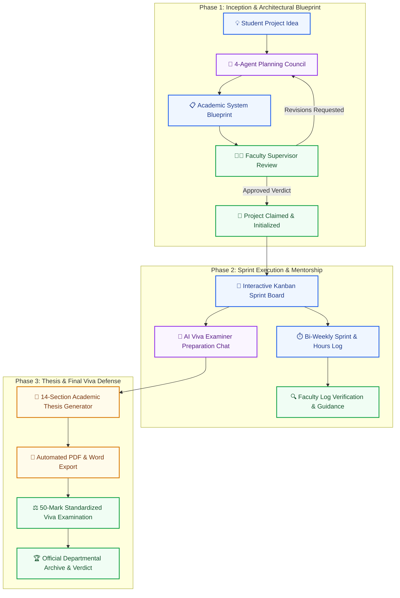
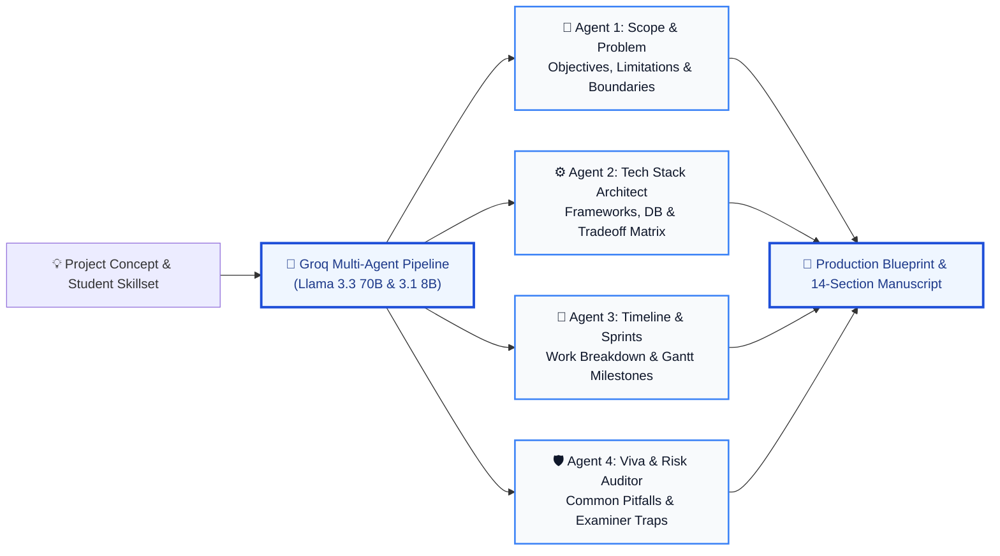

# 🎓 AI Project Mentor

### 🚀 From Project Idea to Final Viva Defense: Institutional Capstone Management & AI Evaluation Suite

<div align="center">

[](https://fastapi.tiangolo.com)
[](https://react.dev)
[](https://vitejs.dev)
[](https://tailwindcss.com)
[](https://www.mongodb.com/atlas)
[](https://groq.com)
[](https://www.python.org)
[](LICENSE)

<p align="center">
  <b>An enterprise-grade academic lifecycle platform engineered for university engineering departments.</b><br/>
  Bridging student architectural planning, bi-weekly progress accountability, and automated manuscript generation with faculty supervisory oversight, audit compliance, and standardized 50-mark viva defense rubrics.
</p>

[✨ Key Innovations](#-key-platform-innovations) •
[🏛️ Architecture Flow](#-dual-portal-lifecycle-architecture) •
[🤖 Multi-Agent Council](#-multi-agent-orchestration-engine) •
[👨‍🎓 Student Portal](#-student-engineering-platform) •
[👩‍🏫 Faculty Portal](#-faculty-evaluation--supervision-portal) •
[⚖️ Viva Rubric](#-standardized-50-mark-viva-defense-rubric) •
[🚀 Installation](#-getting-started--installation)

</div>

---

## 📌 Executive Summary & Problem Statement

In conventional academic environments, undergraduate and graduate engineering capstones suffer from structural inefficiencies:
* **Scope Creep & Architectural Debt**: Students select overambitious or underspecified project ideas without rigorous feasibility analysis or milestone forecasting.
* **Fragmented Supervision**: Faculty mentors lack unified visibility into weekly development hours, sprint blockers, and student accountability.
* **Late-Stage Manuscript Panic**: Formatting a comprehensive 14-section thesis compliant with university black-book guidelines is often delayed until days before the final defense.
* **Subjective Viva Scoring**: External examinations frequently lack standardized, accreditation-aligned (NBA/ABET) digital rubrics.

**AI Project Mentor** resolves these challenges by institutionalizing the entire project lifecycle—from raw concept inception to final external viva defense—in a single secure, role-governed platform.

---

## 🏛️ Dual-Portal Lifecycle Architecture



---

## 🤖 Multi-Agent Orchestration Engine

Rather than relying on generic single-prompt chatbots, the platform orchestrates a **Council of 4 Autonomous Agents** powered by ultra-low-latency Groq Cloud hardware running `llama-3.3-70b-versatile` and `llama-3.1-8b-instant`:



1. **🎯 Problem & Scope Agent**: Formulates formal academic problem definitions, project constraints, user personas, and explicit system boundaries.
2. **⚙️ Architecture & Tech Stack Agent**: Evaluates frontend, backend, database, and DevOps candidates, generating justifiable architectural tradeoffs tailored to candidate experience.
3. **📅 Timeline & Milestone Agent**: Deconstructs semester deliverables into a Gantt-ready chronological sprint schedule categorized across 4 delivery phases.
4. **🛡️ Viva Defense & Risk Agent**: Employs an adversarial persona to predict the 2 most vulnerable technical failure points and simulate probing external examiner questions.

---

## ✨ Key Platform Innovations

| Innovation | Traditional University System | AI Project Mentor Platform |
|---|---|---|
| **Architecture Planning** | Ad-hoc Googling & unverified blogs | 4-Agent structured academic blueprints with tradeoff analysis |
| **Progress Accountability** | Periodic verbal updates or unread emails | Bi-weekly logged hours, blocker submissions & mentor sign-off |
| **Viva Exam Preparation** | Self-study without examiner simulation | Real-time AI Examiner Chatbot trained on the project's exact stack |
| **Thesis Documentation** | Weeks of manual Word formatting errors | Instant 14-section thesis generation in bound PDF & Word (.docx) |
| **Defense Evaluation** | Subjective paper notes and inconsistent marks | Standardized 50-mark digital scorecard with committee verdict |
| **Fault-Tolerant AI** | Brittle single-model dependency | Automatic multi-model fallback chain skipping decommissioned APIs |

---

## 👨‍🎓 Student Engineering Platform

The student portal provides an integrated workstation supporting the entire engineering journey:

* 🤖 **Multi-Agent Architecture Wizard**: Formulates academic problem statements, dynamic scope, recommended tech stacks, and timelines based on candidate skill level.
* 📋 **Interactive Kanban & Roadmap**: Converts multi-agent implementation milestones into manageable development sprints (*To Do*, *In Progress*, *Done*).
* 💬 **AI Mentor Viva Preparation**: Real-time context-aware chat assistant trained on the project's exact stack to simulate tough external examiner viva questions.
* 📈 **Milestone Progress Updates**: Visual completion slider and phase selectors to report live status back to academic supervisors.
* ⏱️ **Bi-Weekly Sprint Logging**: Direct submission of logged hours, weekly accomplishments, and technical blockers for supervisor sign-off.
* 📄 **14-Section Thesis Generator**: Formats complete academic manuscripts ready for black-book binding, complete with one-click PDF and Word (`.docx`) export.

---

## 👩‍🏫 Faculty Evaluation & Supervision Portal

The faculty portal equips professors, project guides, and external examiners with full departmental governance:

* 🏛️ **Centralized Evaluation Hub**: Review pending project blueprints, examine system architectures, and issue formal verdicts (*Approved*, *Needs Revision*, *Rejected*).
* 👥 **Supervisor Allocation Roster**: Institutional registry to claim projects, track mentee count, and supervise progress across academic divisions.
* 📊 **Batch Progress Tracker**: Live dashboard monitoring student phase completions, sprint blockers, and bi-weekly milestone submissions.
* 🔍 **Manuscript Compliance Verifier**: Automated structural consistency and originality audit for submitted thesis reports.
* 📢 **Department Noticeboard**: Broadcast official deadlines, viva schedules, and submission criteria directly to student dashboards.
* ⚖️ **Viva & Defense Rubric Scorecard**: Standardized 50-mark digital evaluation sheet assessing System Architecture (10), Code Execution (20), Presentation (10), and Viva Defense (10).

---

## ⚖️ Standardized 50-Mark Viva Defense Rubric

Aligned with international engineering accreditation standards (NBA Tier-I & ABET Criterion 3 & 5), the platform digitizes the final oral examination:

| Criteria | Max Marks | Evaluated Competencies & Rubric Breakdown |
|---|:---:|---|
| **1. System Architecture & Engineering** | **10** | Modularity, architectural diagram clarity, database normalization, API schema hygiene, and requirement fulfillment. |
| **2. Code Execution & Functional Delivery** | **20** | Live running demonstration, error resilience, test suite coverage, Git workflow, code cleanliness, and deployment viability. |
| **3. Presentation & Manuscript Quality** | **10** | Adherence to standard university 14-section thesis format, citation rigor, visual figure quality, and black-book readiness. |
| **4. Defense Mastery & Viva Q&A** | **10** | Student mastery, rationale behind architectural decisions, domain depth, understanding of edge cases, and future enhancements. |
| **Total Evaluation** | **50** | **Institutional Verdict**: *Distinction (40-50)* • *Satisfactory (25-39)* • *Re-examination Required (<25)* |

---

## 📑 14-Section University Thesis Structure

The built-in document engine automatically structures, formats, and exports complete manuscripts compliant with university black-book regulations:

```
├── CHAPTER 1: TITLE & EXECUTIVE ABSTRACT
├── CHAPTER 2: INTRODUCTION & PROBLEM BACKGROUND
├── CHAPTER 3: PROBLEM FORMULATION & MOTIVATION
├── CHAPTER 4: LITERATURE SURVEY & STATE OF THE ART
├── CHAPTER 5: PROPOSED SYSTEM ARCHITECTURE & BLOCK DIAGRAM
├── CHAPTER 6: FUNCTIONAL & NON-FUNCTIONAL REQUIREMENTS
├── CHAPTER 7: TECHNOLOGY STACK SELECTION & TRADEOFF ANALYSIS
├── CHAPTER 8: DATABASE SCHEMA & DATA FLOW MODELING
├── CHAPTER 9: SYSTEM IMPLEMENTATION & CORE MODULES
├── CHAPTER 10: TESTING METHODOLOGY & TEST CASES
├── CHAPTER 11: RESULTS & EXPERIMENTAL PERFORMANCE ANALYSIS
├── CHAPTER 12: SECURITY, PRIVACY & PRODUCTION COMPLIANCE
├── CHAPTER 13: LIMITATIONS & FUTURE RESEARCH DIRECTIONS
└── CHAPTER 14: REFERENCES & IEEE BIBLIOGRAPHIC CITATIONS
```

---

## 🛠️ Technology Stack & Architectural Roles

```
                      ┌─────────────────────────────────────────┐
                      │          React 18 + Vite Frontend       │
                      │  Tailwind CSS • Lucide Icons • Axios    │
                      └────────────────────┬────────────────────┘
                                           │ HTTP / JSON API
                                           ▼
                      ┌─────────────────────────────────────────┐
                      │          FastAPI Backend Server         │
                      │     Uvicorn • Pydantic v2 • CORS        │
                      └──────┬───────────────────────────┬──────┘
                             │                           │
                             ▼                           ▼
              ┌───────────────────────────┐ ┌───────────────────────────┐
              │     MongoDB Atlas TLS     │ │      Groq Cloud LLM       │
              │  Blueprints • Users •     │ │  Llama 3.3 70B Versatile  │
              │  Viva Scores • Logs       │ │  Llama 3.1 8B Instant     │
              └───────────────────────────┘ └───────────────────────────┘
```

| Component | Technology | Version | Purpose in Platform |
|---|---|---|---|
| **Frontend Framework** | React.js | `^18.2.0` | High-performance component-driven user interface |
| **Build Tool** | Vite | `^6.4.3` | Hot Module Replacement (HMR) and optimized rollup bundle |
| **Styling & Icons** | Tailwind CSS + Lucide | `^3.4.1` / `^0.344.0` | Academic slate/royal blue theme, zero emoji UI components |
| **Backend API** | FastAPI | `^0.110.0` | Asynchronous RESTful microservice with OpenAPI auto-docs |
| **Server Engine** | Uvicorn | `^0.28.0` | Lightning-fast ASGI production web server |
| **Data Validation** | Pydantic v2 | `^2.6.0` | Strict type validation and JSON serialization |
| **Database** | MongoDB Atlas | `^4.6.0` | Document datastore for blueprints, rosters, logs, and scorecards |
| **AI Inference** | Groq Cloud API | `^0.5.0` | Sub-second Llama 3.3 70B and 3.1 8B multi-agent orchestration |
| **PDF Generation** | ReportLab | `^4.1.0` | Programmatic thesis cover pages, headers, footers & typography |
| **Word Export** | python-docx | `^1.1.0` | Native Microsoft Word (`.docx`) manuscript synthesis |

---

## 📂 Repository Layout

```plaintext
AI-Project-Mentor/
├── backend/
│   ├── main.py              # FastAPI endpoints, multi-agent pipelines & auth
│   ├── database.py          # MongoDB Atlas TLS connection & collection indexes
│   ├── models.py            # Pydantic data schemas & request validators
│   ├── agents/              # Council agent prompt templates and logic
│   └── requirements.txt     # Backend Python dependencies
│
├── frontend-react/
│   ├── src/
│   │   ├── components/
│   │   │   ├── Sidebar.jsx                   # University navigation & role menu
│   │   │   └── CustomSelect.jsx              # Accessible styled dropdown selector
│   │   ├── pages/
│   │   │   ├── LandingPage.jsx               # Public university portal landing page
│   │   │   ├── AuthPage.jsx                  # Role-guarded sign-in & registration
│   │   │   ├── DashboardPage.jsx             # Student project hub & progress stats
│   │   │   ├── FacultyDashboardPage.jsx      # Supervised mentees & department roster
│   │   │   ├── WorkspacePage.jsx             # 4-Agent blueprint generation wizard
│   │   │   ├── BenchmarksPage.jsx            # Explore projects & viva rubrics modal
│   │   │   ├── VivaGradingPage.jsx           # Committee 50-mark viva grading portal
│   │   │   ├── NoticeboardPage.jsx           # Cohort institutional announcements
│   │   │   ├── StudentProgressUpdatePage.jsx # Student progress & completion sliders
│   │   │   ├── BatchProgressTrackerPage.jsx  # Faculty batch progress matrix
│   │   │   ├── SettingsPage.jsx              # Institutional profile & security
│   │   │   ├── ChatMentorPage.jsx            # AI mentor external examiner chat
│   │   │   ├── KanbanPage.jsx                # Sprint roadmap milestone board
│   │   │   ├── ThesisDocPage.jsx             # 14-chapter thesis compiler & export
│   │   │   └── ProjectHistoryPage.jsx        # Project revision archive
│   │   ├── App.jsx                           # Viewport route controller & role guards
│   │   ├── index.css                         # Enterprise academic design tokens
│   │   └── main.jsx                          # React application entrypoint
│   ├── tailwind.config.js                   # University white & royal blue theme setup
│   ├── vite.config.js                       # Port 5174 development server config
│   └── package.json                         # Node.js dependencies
│
├── AI_Project_Mentor.ipynb                  # Exploratory agent validation notebook
├── requirements.txt                         # Root Python backend dependencies
├── .env.example                             # Environment variable template
├── LICENSE                                  # MIT Open-Source License
└── README.md                                # Comprehensive repository documentation
```

---

## 🔌 API Endpoints Reference

| Method | Route | Access | Functional Description |
|:---:|---|:---:|---|
| `POST` | `/api/auth/register` | Public | Register student or faculty member with hashed credentials |
| `POST` | `/api/auth/login` | Public | Authenticate user credentials and return active role session |
| `POST` | `/api/generate-blueprint` | Student | Execute 4-agent council to formulate project blueprint |
| `GET` | `/api/user/history` | Student | Fetch all saved project blueprints for authenticated student |
| `GET` | `/api/faculty/blueprints` | Faculty | Fetch institutional project submissions across all batches |
| `POST` | `/api/faculty/review` | Faculty | Record supervisor review comments and approval verdicts |
| `POST` | `/api/mentor/assign` | Faculty | Claim or assign a faculty supervisor to a student capstone |
| `POST` | `/api/student/submit-log` | Student | Log bi-weekly sprint hours, achievements, and blockers |
| `POST` | `/api/mentor/verify-log` | Faculty | Supervisor approval or clarification request for sprint logs |
| `POST` | `/api/faculty/viva-grading` | Faculty | Record official 50-mark viva score breakdown and verdict |
| `GET` | `/api/faculty/viva-scores` | Faculty | Fetch recorded viva scorecard archives across all batches |
| `POST` | `/api/projects/pitfalls` | Public | Generate dynamic Groq-powered architectural pitfalls for domain |
| `POST` | `/api/faculty/verify-report`| Faculty | Run automated structural compliance audit on thesis manuscripts |
| `POST` | `/api/faculty/announcements`| Faculty | Broadcast cohort-wide submission deadlines and viva notices |
| `GET` | `/api/announcements` | Authenticated | Retrieve active cohort announcements for noticeboards |
| `GET` | `/api/export/pdf` | Authenticated | Export executive architectural blueprint into formatted PDF |
| `GET` | `/api/export/docx` | Authenticated | Export project blueprint to Microsoft Word (`.docx`) |
| `GET` | `/api/export/thesis-pdf` | Authenticated | Compile and export complete 14-section thesis manuscript PDF |

---

## 🚀 Getting Started & Installation

### 1. Prerequisites
Ensure the following runtimes are installed on your host system:
* **Node.js**: `v18.x` or higher (`v20.x` recommended)
* **Python**: `3.10` or higher
* **MongoDB**: Local MongoDB instance (`port 27017`) or active [MongoDB Atlas](https://www.mongodb.com/atlas) connection URI
* **Groq Cloud API Key**: Obtain a free, high-speed API key from [console.groq.com](https://console.groq.com)

---

### 2. Backend Installation

1. Navigate into the `backend/` directory:
   ```bash
   cd backend
   ```

2. Create and activate a dedicated Python virtual environment:
   ```bash
   # Windows (PowerShell / Command Prompt)
   python -m venv venv
   venv\Scripts\activate

   # macOS / Linux
   python3 -m venv venv
   source venv/bin/activate
   ```

3. Install required Python packages:
   ```bash
   pip install -r requirements.txt
   ```

4. Create a `.env` file in the project root or `backend/` folder:
   ```env
   GROQ_API_KEY=gsk_your_groq_api_key_here
   MONGODB_URI=mongodb+srv://<username>:<password>@cluster.mongodb.net/?retryWrites=true&w=majority
   DATABASE_NAME=ai_project_mentor_db
   ```

5. Launch the FastAPI ASGI server:
   ```bash
   uvicorn main:app --reload --port 8000
   ```
   * **API Root**: [http://127.0.0.1:8000](http://127.0.0.1:8000)
   * **Interactive Swagger UI**: [http://127.0.0.1:8000/docs](http://127.0.0.1:8000/docs)
   * **ReDoc Documentation**: [http://127.0.0.1:8000/redoc](http://127.0.0.1:8000/redoc)

---

### 3. Frontend Installation

1. Open a new terminal and navigate into `frontend-react/`:
   ```bash
   cd frontend-react
   ```

2. Install Node.js dependencies:
   ```bash
   npm install
   ```

3. Start the Vite development server:
   ```bash
   npm run dev
   ```
   * **Web Application Portal**: [http://localhost:5174](http://localhost:5174)

---

## 👥 User Roles & End-to-End Workflows

### 👨‍🎓 Student End-to-End Journey
```
1. Sign In ➡️ 2. Formulate Blueprint ➡️ 3. Execute Kanban ➡️ 4. Bi-Weekly Log ➡️ 5. Viva Prep ➡️ 6. Export Thesis
```
1. **Access Portal**: Sign in with student credentials to view the personal project dashboard.
2. **AI Architecture Wizard**: Submit project name, domain, and problem statement to receive a tailored academic blueprint.
3. **Sprint & Task Execution**: Organize tasks across Kanban columns (*To Do*, *In Progress*, *Done*) and update live progress percentage.
4. **Bi-Weekly Accountability**: Submit logged development hours, completed tasks, and technical blockers for faculty sign-off.
5. **AI Viva Simulation**: Practice defending the project against challenging questions asked by the context-aware AI Examiner.
6. **Thesis Manuscript Export**: Compile the final 14-section thesis into print-ready PDF or Word (`.docx`) format.

---

### 👩‍🏫 Faculty & Examiner End-to-End Journey
```
1. Faculty Sign In ➡️ 2. Supervise Mentees ➡️ 3. Track Batch ➡️ 4. Audit Manuscripts ➡️ 5. Grade Viva Defense
```
1. **Institutional Login**: Access the supervisor evaluation dashboard.
2. **Review & Allocate**: Review submitted student blueprints, provide architectural notes, and approve projects.
3. **Log Verification**: Audit bi-weekly sprint logs, verify student development hours, and address roadblocks.
4. **Cohort Announcements**: Post binding deadlines, preliminary review schedules, and viva guidelines.
5. **Final Examination & Scoring**: Use the digital 50-mark scorecard during the oral viva defense to compute grades and log formal committee verdicts.

---

## 🛡️ Reliability & Fault Tolerance

* **Automated LLM Fallback Chain**: In the event of upstream rate limits or decommissioned models, the system automatically routes queries through a multi-model fallback chain (`llama-3.3-70b-versatile` $\rightarrow$ `llama-3.1-8b-instant` $\rightarrow$ `qwen/qwen3.8-27b` $\rightarrow$ `mixtral-8x7b-32768`), guaranteeing zero downtime during viva season.
* **Resilient Startup Error Sanitization**: Automated cache sanitization cleanses any stored legacy API errors from MongoDB Atlas on server reboot.
* **CORS & Data Protection**: Cross-Origin Resource Sharing is configured to support institutional subdomains, and MongoDB Atlas connections utilize TLS 1.3 encryption.

---

## 📜 Academic Honor Code & Attribution

This platform is developed for university engineering departments to foster academic integrity, architectural excellence, and transparent research. All AI-generated blueprints serve as educational scaffolding; students are required to write, test, and defend their own implementation code.

---

## 📄 License

Distributed under the **MIT License**. See [`LICENSE`](LICENSE) for complete details.

<div align="center">
  <sub>Engineered with precision for University Engineering Capstone Departments. From Project Idea to Final Viva Defense.</sub>
</div>